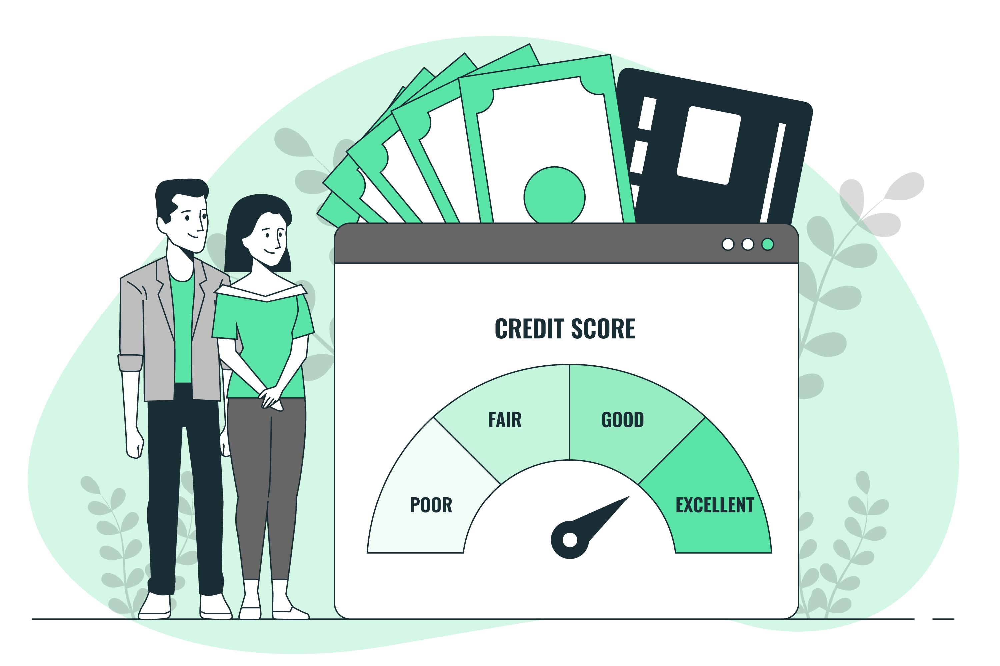

<p align="center">
  
</p>

<h2 align="center">Automated Credit Score Evaluation System</h2>
<p align="center"><b>A machine learning–driven project to predict loan default risk and generate transparent credit scores.</b></p>

<p align="center">
  <a href="https://streamlit.io/"></a>
  <a href="https://numpy.org/"></a>
  <a href="https://pandas.pydata.org/"></a>
  <a href="https://scikit-learn.org/"></a>
  <a href="https://xgboost.readthedocs.io/"></a>
  <a href="https://joblib.readthedocs.io/"></a>
</p>

---

## Overview

The Automated Credit Score Evaluation System employs a logistic regression model to:
- Estimate the probability that a loan applicant will default.
- Map that probability to a credit score between 300 and 900.
- Categorize risk levels: **Poor (300–500), Fair (501–650), Good (651–800), Excellent (801–900)**.

This tool provides both batch processing for large datasets and an interactive UI for single-customer scoring.

---

## 🚀 Key Features

- **High-Recall Default Prediction**: Optimized to minimize false negatives on defaulters.
- **Credit Score Mapping**: Customizable scoring curve following industry norms.
- **Risk Tiers**: Intuitive categories for decision-making.
- **Data Leakage Prevention**: Strict train/test split before feature transformations.
- **Class Imbalance Handling**: SMOTE Tomek pipeline ensures balanced training.
- **Feature Engineering**: Ratios like Loan-to-Income (LTI), delinquency frequency, and average days past due.
- **Hyperparameter Optimization**: Optuna-driven tuning for best performance.
- **Evaluation Metrics**: AUC-ROC, Gini (> 0.7), KS statistic (> 0.4), decile-wise analysis.
- **Interactive Streamlit App**: Instant single-user scoring with probability plots.

---

## 📁 Project Structure

```
app/
│
├── artifacts/
│   ├── model_data.joblib        # Trained ML model
│
├── main.py                      # Core Streamlit app
├── prediction_helper.py         # Scoring logic & preprocessing helpers
├── app_image.jpg                # Local image for README
├── .gitignore                   # Git ignore rules
├── requirements.txt             # Project dependencies
└── README.md                    # Project overview
```

---

## Getting Started

### Installation Steps

1. **Clone the Repository**

   ```bash
   git clone https://github.com/AnkitAmbasana/Automated_Credit_Score_System.git
   cd credit-score-system
   ```

2. **Install Dependencies**

   ```bash
   pip install -r requirements.txt
   ```
  
3. **Run the Streamlit App**

   ```bash
   streamlit run main.py
   ```
  
## Contributing

To Contribute, Please submit issues or pull requests for enhancements or fixes.

---

## License

Licensed under the Apache 2.0 License.

---

*Transform credit risk management with precision and ease!*